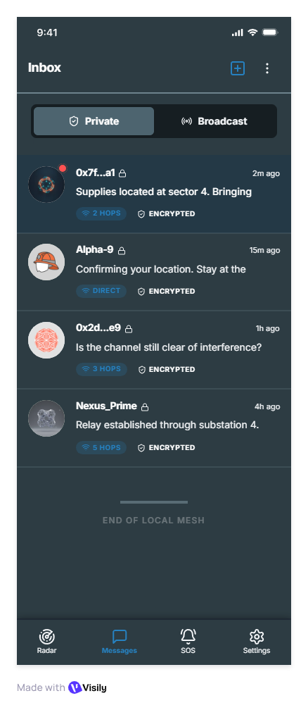

# ResQMesh 🛜

<p align="center">
  
</p>

## Overview
ResQMesh is a robust, decentralized, serverless communication platform designed for emergency responders and citizens operating in zero-infrastructure environments. When cell towers collapse, Wi-Fi drops, and grid power fails during natural disasters, ResQMesh forms an autonomous Bluetooth Low Energy (BLE 5.4) Scatternet to keep critical communications alive.

## The Problem It Solves
During catastrophic events (hurricanes, earthquakes, grid failures), traditional communication infrastructure is often the first to fail. Emergency responders and civilians are left isolated, unable to coordinate rescues or broadcast life-saving information. 

ResQMesh solves this by turning every Android smartphone into an autonomous router. If Alice is out of range of Charlie, but Bob is in the middle, Alice's message will seamlessly hop through Bob's phone to reach Charlie. 

## Core Features
*   **Decentralized Mesh Routing:** Automatically forms a Tree/Scatternet topology to prevent radio collisions while maximizing range.
*   **Serverless Private & Public Chat:** Broadcast SOS messages to the entire mesh, or establish End-to-End Encrypted (E2E) private channels using Protobuf serialization.
*   **Hybrid Walkie-Talkie (Live Audio):** Stream compressed G.711 voice packets live over the mesh. If a connection drops during transmission, the system falls back to a dual-recorded Base64 WAV file, ensuring the voice note is always delivered.
*   **Offline GPS SOS:** Broadcasts raw GPS coordinates in emergency payloads, rendering responder positions on a fully offline map (OSMDroid).
*   **Battery-Aware Elections:** Nodes automatically negotiate Master/Slave GATT roles based on battery levels to preserve the network's lifespan.

<p align="center">
  
</p>

## Clean Architecture (Modular Design)
ResQMesh was rigorously refactored to adhere to enterprise-grade Clean Architecture and SOLID principles to ensure long-term scalability and testability.

### 📁 Folder Structure
```text
app/src/main/java/com/example/testresqmesh/
├── core/                  # Foundation Layer
│   ├── di/                # Koin Dependency Injection Modules
│   ├── domain/            # Core Business Logic (Use Cases)
│   ├── location/          # Abstracted Location Clients
│   ├── network/           # Bluetooth Mesh & Payload Routing
│   │   ├── bluetooth/     # Extracted BLE Components (Scanner, Advertiser)
│   │   ├── gatt/          # Modular GATT Server & Client Managers
│   │   ├── state/         # Centralized Thread-Safe BLE State Store
│   │   └── dispatch/      # Strategy Pattern Handlers for Protobuf
│   └── ui/                # Core UI Components & Jetpack Compose Theme
├── data/                  # Data Layer
│   ├── local/             # Room Database (Offline Storage)
│   └── repository/        # Mesh Repository (Single Source of Truth)
└── feature/               # Feature Modules (UI & ViewModels)
    ├── comms/             # Public/Private Chat & Walkie Talkie
    ├── profile/           # User Identity Management
    ├── radar/             # Network Visualizer & Topology Graph
    ├── setup/             # Onboarding & Permissions
    └── sos/               # Offline Maps & Emergency Broadcasting
```

## Tech Stack
*   **Language:** Kotlin
*   **UI Toolkit:** Jetpack Compose (Material 3)
*   **Dependency Injection:** Koin (Zero code-generation overhead)
*   **Local Storage:** Room Database
*   **Data Serialization:** Protocol Buffers (Protobuf)
*   **Networking:** Bluetooth Low Energy (BLE) GATT & Scatternets
*   **Maps:** OSMDroid (Offline mapping)

## Getting Started
1. Clone the repository.
2. Open the project in Android Studio.
3. Build and deploy to at least **two** physical Android devices (BLE Mesh cannot be tested on an emulator).
4. Grant Location and Nearby Devices permissions on startup.
5. Watch the devices automatically discover and form a mesh!
