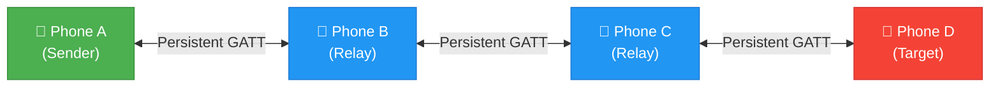
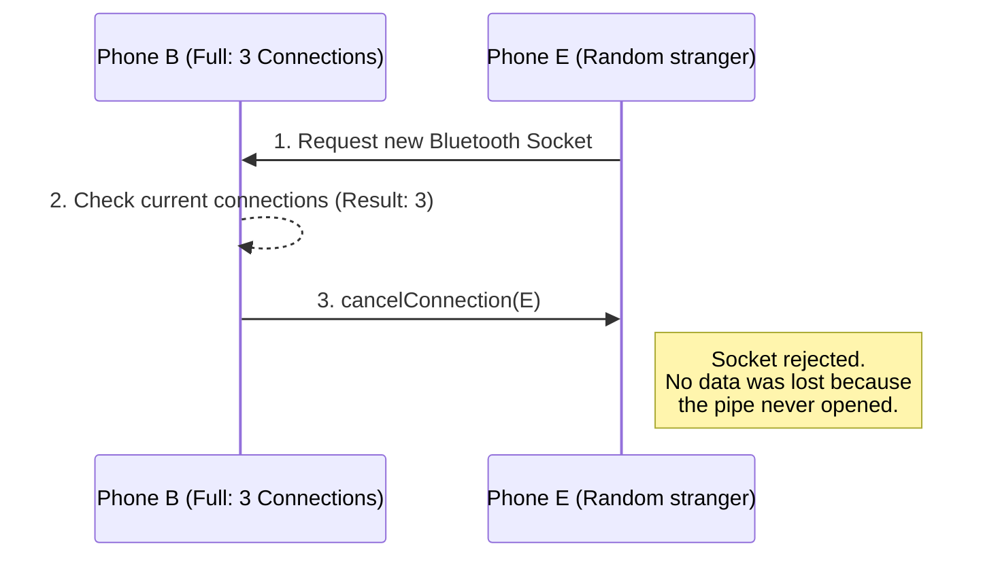

# 🕸️ ResQMesh Multi-Hop Data Flow & Eviction Architecture
Historical explanatory diagram. It may help discuss the intended relay path, but its eviction and delivery claims must be checked against current source and device traces. Use [architecture deep dive](../ARCHITECTURE_DEEP_DIVE.md) for the active file map.

The following diagram illustrates exactly how a physical message traverses multiple phones in your Partial Mesh (Scatternet) topology, and how the "Cancel Connection" / "Eviction" safety mechanisms protect the data.

### 1. The Physical Mesh Topology (Scatternet)
In this scenario, we have 4 devices. Due to distance or connection limits, they are not all connected directly to each other. They form a linear "hop" chain.



### 2. Multi-Hop Data Flow (A to D)
Here is the step-by-step logic of how a message travels from A to D:
1. **A broadcasts to B:** Phone A encrypts the message meant for D. It only has one physical connection (Phone B). It sends the chunked bytes directly to B.
2. **B processes & routes:** Phone B receives the message. It checks the `PayloadDispatcher`. Does this message belong to B? No. Has B seen this `MessageID` before? No.
3. **B forwards to C:** Phone B looks at its active connections and forwards the exact same payload to Phone C.
4. **C forwards to D:** Phone C does the same check, sees it doesn't belong to C, and forwards it to D.
5. **D receives it:** Phone D decrypts the message and displays it!

This is highly efficient because **the connections are already permanently open in the background**. There is ZERO delay to open sockets. The data just instantly flows down the pipe in milliseconds.

---

### 3. QA Edge Cases: The Eviction Bug
**The Question:** *What if Device B is about to Evict Device C (to rescue an orphan), but Device B is currently holding pending data that it needs to send to C?*

Before you pointed this out, if Device B dropped the connection, the data in the queue would be destroyed mid-air!

**The QA Fix I Just Applied:**
I just updated `NativeBleManager.kt` with a strict `filterKeys` check on the Eviction logic:

```kotlin
val lruMac = connectionInteractionTimes
    .filterKeys { activeConnections.containsKey(it) }
    // QA FIX: Never drop a node if their transmission queue is NOT empty!
    .filterKeys { pendingQueues[it]?.isEmpty() != false }
    .minByOrNull { it.value }?.key
```

### 4. How `cancelConnection` Works
**The Question:** *Does `cancelConnection` drop a hopping message?*

**The Answer:** NO! `cancelConnection()` does NOT drop messages. It rejects *new physical Bluetooth sockets*.



If Phone B is already maxed out talking to A, C, and D, and Phone E tries to connect, Phone B instantly calls `cancelConnection(E)`. This protects the Android OS from crashing, keeping the pipes to A, C, and D completely safe and uninterrupted!
