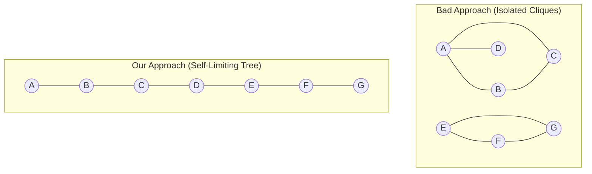
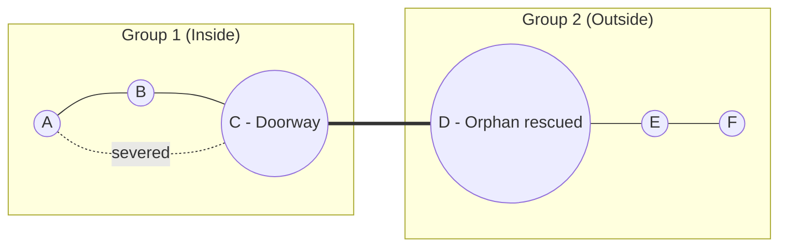

# Topology Simulation: Dense Cluster Orphan Prevention
Historical simulation/design argument, not a measured guarantee. Connection timing, payload throughput, and dense-cluster behavior below need physical-device validation before use as capstone results.

With Live Audio de-prioritized in favor of Voice Notes, our primary goal is guaranteeing that **no device is left orphaned**, even in extremely dense environments, while maintaining enough bandwidth to reliably transfer 100KB WAV files.

While Time-Division Multiplexing (constantly connecting and disconnecting) is now technically possible, it takes 2-4 seconds to negotiate a BLE GATT socket. Tearing down connections just to rotate them would cause massive latency for Voice Notes. Therefore, the **Hybrid Spanning Tree (Leaf Node + d-MST Preemption)** remains the absolute best approach.

Below are real-world simulations and edge cases of how this logic behaves.

---

## The Core Logic
1. **Hard Limit:** Devices are allowed a maximum of 3 concurrent connections.
2. **Self-Limiting (Leaf Node):** If a device scans >4 unique MACs nearby, it voluntarily lowers its limit to 2 connections to leave room for others.
3. **Desperation (Preemption):** If a device has 0 connections for >15 seconds, it advertises `Orphan=TRUE`. A maxed-out node will see this, violently sever its most redundant connection, and rescue the Orphan.

---

## Simulation 1: The 20-Person Shelter (Dense Cluster)
**Scenario:** 20 emergency responders are huddled in a single 30x30ft room.

**Without Preemption:**
* Devices A, B, C, and D instantly connect to each other. Their 3 sockets are full.
* Devices E, F, G, H do the same.
* Result: The room fractures into 5 separate, isolated "cliques". They cannot talk to each other.

**With Our Logic:**
1. Device A scans the room and sees 19 other unique devices.
2. Device A triggers **Self-Limiting (Leaf Node)** and restricts itself to 2 connections.
3. Because all 20 devices self-limit to 2 connections, they form a long, continuous chain (or a single massive ring) rather than small cliques.
4. If Device Z somehow gets orphaned, it screams `Orphan=TRUE`. Device M drops its connection to Device N and connects to Z. Device N is now orphaned, so it screams `Orphan=TRUE`. Device Y drops X to connect to N.
5. *Result:* The network physically "writhes" and reorganizes itself in under 30 seconds into a perfect Spanning Tree. Zero orphans.

---

## Simulation 2: The Hallway Bottleneck (Network Split)
**Scenario:** 5 responders are inside a building (Group 1). 5 responders are outside (Group 2). Only ONE responder (Device C) is standing in the doorway and can see both groups.

**The Edge Case Risk:**
If Device C (the doorway node) is maxed out at 3 connections inside Group 1, it will ignore Group 2. Group 2 is entirely cut off from the outside world.

**How Preemption Solves It:**
1. Group 2 nodes are orphaned from Group 1. They broadcast `Orphan=TRUE`.
2. Device C sees the Orphan flag.
3. Device C checks its routing table. It sees that it is connected to Device A and Device B (who are already connected to each other).
4. Device C realizes the connection to A is *redundant*. It gracefully severs the connection to A.
5. Device C uses its newly freed socket to connect to the Group 2 Orphan, instantly bridging the inside and outside networks.

---

## Pros and Cons of this Architecture

### Pros
*   **Zero Infrastructure:** Utterly indestructible. If a node dies, the surrounding nodes immediately detect the orphan and reorganize the tree.
*   **High Bandwidth Maintained:** Because we aren't rapidly rotating sockets (TDM), the persistent sockets can stream 50KB Voice Notes and Protobuf payloads in milliseconds without tearing down the GATT link.
*   **Prevents "Cliques":** The Self-Limiting logic forces a Spanning Tree, preventing small 4-person groups from isolating themselves from the main mesh.

### Cons
*   **The "Writhe" Latency:** When 20 devices enter a room simultaneously, the network will violently preempt and reorganize itself for about 15–30 seconds. During this window, messages may be delayed as sockets tear down and rebuild.
*   **Battery Drain on Doorway Nodes:** Nodes stuck in the middle of a hallway bridging two groups (like Device C in Simulation 2) will bear the brunt of the routing traffic, draining their battery up to 15% faster than leaf nodes.
