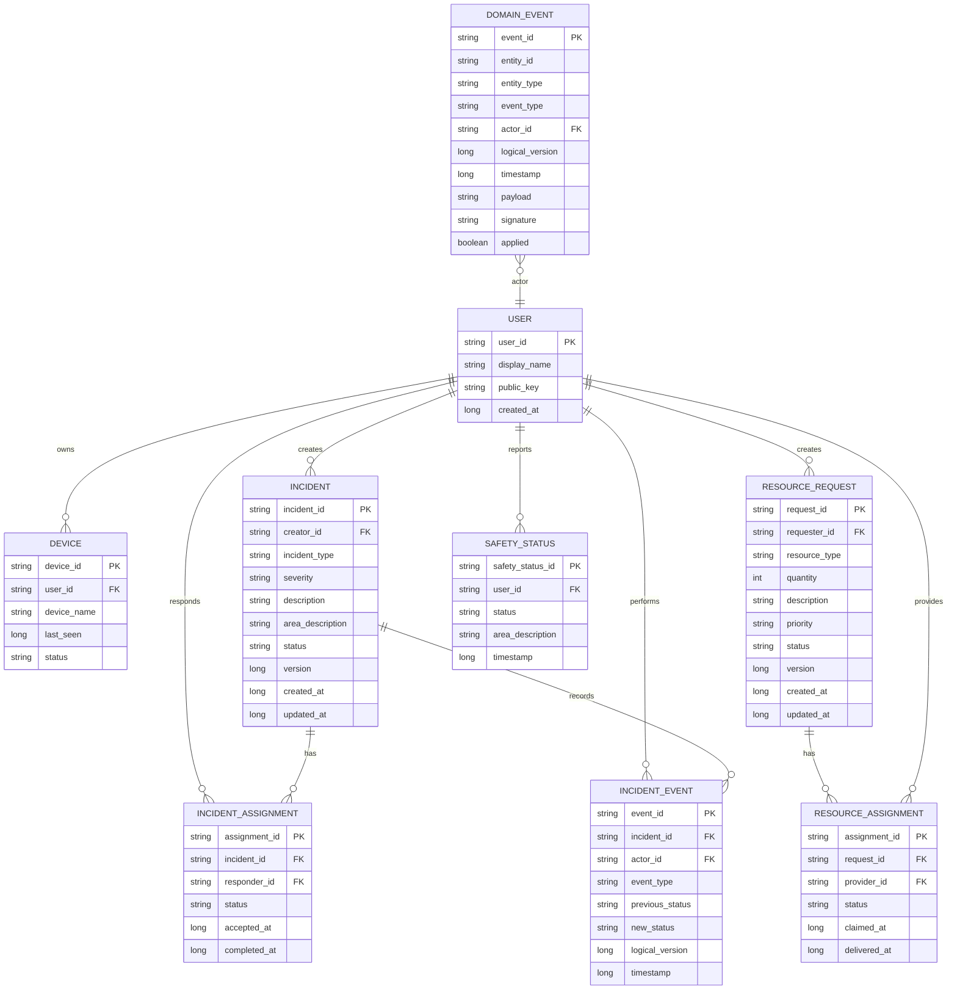

> Historical/inactive reference archived 2026-10-04; see [disposition index](../README.md). Original claims, hashes and instructions are not current authorization.

# ResQMesh Transactional Layer Implementation Plan

**Project:** ResQMesh
**Purpose:** Add transactional emergency workflows without replacing or destabilizing the existing offline BLE mesh network.
**Primary implementation target:** Android/Kotlin ResQMesh application
**Core constraint:** The existing mesh transport must remain the networking foundation. Transaction logic must be layered on top of it.

---

# 1. Executive Summary

ResQMesh already provides the technically difficult networking foundation:

- nearby device discovery
- direct Bluetooth/BLE connections
- limited simultaneous physical peers
- multi-hop message forwarding
- packet/message caching
- duplicate suppression
- private messaging
- broadcast messaging
- voice messages
- image transfer
- channels
- SOS broadcast
- planned TTL, encryption, RSSI, and presence improvements

The main architectural change in this plan is **not a mesh rewrite**.

Instead, ResQMesh will gain a new application/domain layer containing transactional emergency workflows:

1. **Emergency Incident / SOS Management**
2. **Resource Request Coordination**
3. **Safety Check-In**

The mesh remains responsible only for transporting small packets between devices.

The new transactional layer will be responsible for:

- creating transactions
- tracking transaction state
- keeping transaction history
- generating immutable domain events
- persisting events locally
- reconciling missed events after reconnection
- resolving duplicate events
- applying deterministic conflict rules
- prioritizing critical emergency traffic

The target architecture is:

```text
┌─────────────────────────────────────────────┐
│                    UI                       │
│ Chat │ SOS │ Incidents │ Resources │ Safety│
├─────────────────────────────────────────────┤
│              DOMAIN / APP LAYER             │
│ Incident Manager                            │
│ Resource Request Manager                    │
│ Safety Check-In Manager                     │
│ State Machines                              │
├─────────────────────────────────────────────┤
│                 EVENT LAYER                 │
│ DomainEvent                                 │
│ Event Store                                 │
│ Sync / Reconciliation                       │
│ Conflict Resolution                         │
│ Priority Queue                              │
├─────────────────────────────────────────────┤
│             EXISTING RESQMESH MESH          │
│ BLE Connections                             │
│ Routing / Forwarding                        │
│ Packet Cache / Deduplication                │
│ Store-and-Forward                           │
│ TTL / Retry                                 │
├─────────────────────────────────────────────┤
│               BLUETOOTH / BLE               │
└─────────────────────────────────────────────┘
```

The most important architectural rule is:

> **The mesh must not need to understand emergency business logic.**

It should only know that it is transporting a packet with a type, priority, source, destination, TTL, and payload.

---

# 2. Non-Negotiable Constraints

Antigravity must follow these constraints while implementing this plan.

## 2.1 Preserve the Existing Mesh

Do **not** replace the current networking architecture unless an existing implementation bug makes a small targeted fix necessary.

Preserve:

- peer discovery
- peer connection management
- current 2–3 direct physical peer strategy
- routing logic
- multi-hop forwarding
- current message deduplication behavior where possible
- existing text/private/broadcast messaging
- current image and voice features
- existing channel behavior

The transactional feature must be additive.

---

## 2.2 No Full Database Synchronization

Never implement synchronization as:

```text
Device A sends entire Room database
→ B sends entire database
→ C sends entire database
```

Do not periodically broadcast entire tables.

Synchronize **events**, not databases.

---

## 2.3 No Mandatory Online Login

ResQMesh is designed for infrastructure failure.

Do not require:

- email login
- password login
- Google login
- Firebase authentication
- internet access
- cloud account creation

Instead use an offline local identity.

---

## 2.4 Emergency Traffic Must Have Higher Priority Than Media

An SOS transaction must not wait for:

- an image upload
- a voice transfer
- presence chatter
- ordinary chat traffic

Implement a priority-aware outbound queue.

---

## 2.5 Every Domain Event Must Be Idempotent

Receiving the same event multiple times must not apply the event multiple times.

Example:

```text
A → B → D
A → C → D
```

If D receives `EVT-100` through B and C, D processes it only once.

---

# 3. Scope

## 3.1 MVP Scope

Implement the following first:

### A. Offline Local Identity

Each installation gets:

- `userId`
- `deviceId`
- `displayName`
- generated public/private key pair if practical in the existing codebase

No login is required.

---

### B. Emergency Incident / SOS Transaction

Primary workflow:

```text
OPEN
  ↓
ACKNOWLEDGED
  ↓
ASSIGNED
  ↓
RESPONDING
  ↓
RESOLVED
```

Additional valid exits:

```text
OPEN → CANCELLED
ACKNOWLEDGED → CANCELLED
ASSIGNED → CANCELLED
RESPONDING → CANCELLED
```

Do not begin with an overly complex disaster-management workflow.

---

### C. Transaction Event History

Every meaningful state change is stored as an immutable event.

Example:

```text
INCIDENT_CREATED
INCIDENT_ACKNOWLEDGED
INCIDENT_ASSIGNED
INCIDENT_RESPONSE_STARTED
INCIDENT_RESOLVED
```

---

### D. Small Event Synchronization

When peers reconnect:

- compare event knowledge
- request only missing events
- apply missing events
- converge transaction state

---

### E. Emergency Traffic Priority

At minimum:

```text
P0 - SOS / critical emergency
P1 - incident state updates
P2 - resource/safety transactions
P3 - normal text
P4 - presence
P5 - voice
P6 - image
```

Exact numeric implementation may differ.

---

## 3.2 Phase 2 Scope

After SOS transactions are stable:

### Resource Requests

States:

```text
REQUESTED
  ↓
CLAIMED
  ↓
IN_TRANSIT
  ↓
DELIVERED
```

Optional:

```text
REQUESTED → CANCELLED
CLAIMED → RELEASED → REQUESTED
```

Resource categories:

- water
- food
- medicine
- first aid
- rescue assistance
- shelter
- charging/power
- other

---

### Safety Check-In

Statuses:

- SAFE
- NEED_HELP
- INJURED
- EVACUATING
- UNKNOWN

Safety check-ins should remain lightweight.

---

# 4. User Identity Model

## 4.1 First-Launch Flow

```text
Install ResQMesh
      ↓
Open App
      ↓
Enter Display Name
      ↓
Generate userId
      ↓
Generate deviceId
      ↓
Generate key pair
      ↓
Persist locally
      ↓
Ready to join mesh
```

Example:

```text
displayName = "Kyle"
userId = "USR-8F2A91..."
deviceId = "DEV-31CC..."
```

Do not use the display name as a unique identifier.

Two users may both be named `John`.

---

## 4.2 Identity Persistence

The identity must survive:

- app restarts
- Bluetooth disconnects
- device reconnection
- temporary network partitions

If the app data is cleared or the application is reinstalled, creating a new identity is acceptable for the MVP unless identity backup is already part of the project.

---

## 4.3 Cryptographic Identity

If feasible without destabilizing the MVP:

- generate a public/private key pair locally
- retain the private key only on the local device
- share the public key when peers exchange identity metadata
- sign important transaction events

For the first stable implementation, event signing may be staged after basic transaction propagation is working.

Do not block the whole feature on cryptography.

---

# 5. Recommended Data Model / ERD

The following model should be adapted to the project's existing naming conventions.



---

# 6. Suggested Room Entities

Use Room for local persistence unless the existing application already uses another reliable local storage technology.

Suggested entities:

```text
UserEntity
DeviceEntity
IncidentEntity
IncidentAssignmentEntity
IncidentEventEntity
ResourceRequestEntity
ResourceAssignmentEntity
SafetyStatusEntity
DomainEventEntity
ProcessedEventEntity or equivalent
OutboundEventEntity / SyncQueueEntity
PeerEventKnowledgeEntity (optional)
```

Do not create unnecessary duplicate tables if the existing repository already has equivalent data.

---

# 7. Domain Event Architecture

## 7.1 DomainEvent

Create a generic representation for transactional changes.

Conceptual Kotlin model:

```kotlin
data class DomainEvent(
    val eventId: String,
    val entityId: String,
    val entityType: EntityType,
    val eventType: EventType,
    val actorId: String,
    val logicalVersion: Long,
    val timestamp: Long,
    val payload: String,
    val signature: String? = null
)
```

Possible enums:

```kotlin
enum class EntityType {
    INCIDENT,
    RESOURCE_REQUEST,
    SAFETY_STATUS
}
```

```kotlin
enum class EventType {
    INCIDENT_CREATED,
    INCIDENT_ACKNOWLEDGED,
    INCIDENT_ASSIGNED,
    INCIDENT_RESPONSE_STARTED,
    INCIDENT_RESOLVED,
    INCIDENT_CANCELLED,

    RESOURCE_REQUEST_CREATED,
    RESOURCE_REQUEST_CLAIMED,
    RESOURCE_IN_TRANSIT,
    RESOURCE_DELIVERED,
    RESOURCE_CANCELLED,

    SAFETY_STATUS_CHANGED
}
```

Adapt enum naming to project conventions.

---

# 8. Event vs Packet

Keep these separate.

## Domain Event

Represents a business action.

Example:

```text
eventId = EVT-1001
entityId = SOS-123
eventType = INCIDENT_ASSIGNED
```

## Mesh Packet

Represents one network transport unit.

Example:

```text
packetId = PKT-B991
contains eventId = EVT-1001
```

If another node forwards the same business event:

```text
packetId = PKT-C104
contains eventId = EVT-1001
```

This separation allows:

- transport deduplication
- business event deduplication
- retries
- auditing
- safer forwarding

---

# 9. Generic Mesh Envelope

Do not create an entirely different transport protocol for every feature.

Use a generic envelope adapted to the existing packet type.

Conceptual example:

```kotlin
data class MeshEnvelope(
    val packetId: String,
    val sourceDeviceId: String,
    val destinationId: String?,
    val messageType: MeshMessageType,
    val priority: Int,
    val createdAt: Long,
    val expiresAt: Long?,
    val hopCount: Int,
    val ttl: Int?,
    val payload: ByteArray
)
```

Possible message types:

```text
CHAT
DOMAIN_EVENT
EVENT_SYNC_SUMMARY
EVENT_SYNC_REQUEST
EVENT_SYNC_RESPONSE
MEDIA_METADATA
MEDIA_CHUNK
PRESENCE
CONTROL
```

Use the existing packet abstraction whenever possible rather than introducing another parallel networking stack.

---

# 10. SOS / Incident State Machine

## 10.1 States

```text
OPEN
ACKNOWLEDGED
ASSIGNED
RESPONDING
RESOLVED
CANCELLED
```

---

## 10.2 Valid State Transitions

```text
OPEN → ACKNOWLEDGED
OPEN → ASSIGNED
OPEN → CANCELLED

ACKNOWLEDGED → ASSIGNED
ACKNOWLEDGED → CANCELLED

ASSIGNED → RESPONDING
ASSIGNED → RESOLVED
ASSIGNED → CANCELLED

RESPONDING → RESOLVED
RESPONDING → CANCELLED
```

Invalid transitions must be rejected locally.

Example:

```text
RESOLVED → OPEN
```

must not be allowed as a normal state transition.

A new incident should be created instead.

---

## 10.3 SOS Creation

When the user presses SEND SOS:

1. Validate form.
2. Create a new `IncidentEntity`.
3. Create `INCIDENT_CREATED`.
4. Save the incident locally.
5. Save the event locally.
6. Mark the event as processed locally.
7. Add the event to the outbound queue with P0 priority.
8. Immediately update UI.
9. Mesh layer transports the event.
10. Receiving devices deduplicate, persist, apply, and forward according to mesh rules.

The sender should not wait for network delivery before showing the incident locally.

---

## 10.4 Acknowledge vs Assign

These mean different things.

### ACKNOWLEDGED

"I have seen this emergency."

This does not necessarily mean the user will respond.

### ASSIGNED

"I am taking responsibility for responding."

This distinction prevents accidental responder assignment.

---

# 11. Responder Assignment

For the MVP, support one primary responder.

Recommended model:

```text
primaryResponderId
```

Optionally allow support responders later.

Do not implement complicated team coordination before the first incident workflow is stable.

---

# 12. Conflict Handling

Distributed offline systems can receive conflicting updates.

Example:

```text
B accepts SOS-001
F also accepts SOS-001
```

because the network was temporarily partitioned.

Do not silently overwrite based only on packet arrival order.

For MVP conflict resolution:

1. Compare transaction/entity logical version.
2. Validate whether each event is legal from the known previous state.
3. If two same-level competing assignment events exist:
   - use deterministic ordering
   - earliest valid event timestamp
   - if identical/untrustworthy timestamps, use stable event ID ordering
4. Mark the non-winning assignment event as a conflict in logs.
5. Do not repeatedly alternate state.

Optional later improvement:

- primary responder
- supporting responders

Document conflict decisions for thesis testing.

---

# 13. Logical Versioning

Each transactional entity should maintain a logical version.

Example:

```text
Incident created    version 1
Acknowledged        version 2
Assigned            version 3
Responding          version 4
Resolved            version 5
```

Do not depend solely on phone clock accuracy.

Use timestamps for UX and additional conflict ordering, but logical versions should represent event sequence.

---

# 14. Event Deduplication

Every event must have a globally unique `eventId`.

Suggested:

```text
UUID.randomUUID().toString()
```

or the project's existing unique ID generation.

Receive pipeline:

```text
Receive DomainEvent
      ↓
Is eventId already known?
      ├─ YES → do not apply again
      │        optionally update packet-level metadata
      │        stop business processing
      │
      └─ NO
          ↓
      validate event
          ↓
      persist event
          ↓
      apply state transition
          ↓
      mark processed
          ↓
      forward if allowed
```

Deduplication records should survive app restarts for a practical retention period.

---

# 15. Store-and-Forward

If a destination or downstream peer is unavailable:

1. Keep eligible events in a persistent outbound queue.
2. Retry when an appropriate peer is connected.
3. Use exponential or bounded retry behavior.
4. Do not hot-loop constantly.
5. Drop or archive expired noncritical events according to policy.
6. Keep unresolved SOS transactions available longer than ordinary presence events.

---

# 16. Event Expiration

Application expiration and network TTL are separate concepts.

Recommended initial policy:

| Type | Suggested relevance |
|---|---|
| Presence | 1–5 minutes |
| Safety status | 1 hour or until replaced |
| Ordinary chat forwarding | existing project policy |
| Resource request | until fulfilled/cancelled or bounded hours |
| SOS incident | until resolved/cancelled, with safety cap |
| Media chunks | transfer-session lifetime |

Do not blindly expire an unresolved emergency because a packet hop TTL reached zero.

---

# 17. Priority Queue

Implement or adapt a priority queue at the outbound scheduling layer.

Recommended ordering:

```text
P0 - SOS creation / life-safety critical events
P1 - SOS state transitions
P2 - resource requests / safety status
P3 - ordinary text/control
P4 - presence
P5 - voice
P6 - image
```

Important behavior:

```text
Image chunks transferring
        ↓
SOS enters queue
        ↓
finish current atomic chunk if necessary
        ↓
send SOS
        ↓
resume lower-priority transfer
```

Do not corrupt in-progress streams by interrupting them at an unsafe byte boundary.

Priority should operate at the packet/chunk scheduling level.

---

# 18. Reconnection Synchronization

When two peers connect or reconnect, they should not send the entire database.

Use a bounded event reconciliation protocol.

## Version A - Simple MVP

Each peer shares a compact list or summary of recent event IDs.

Example:

```text
B knows:
EVT-100
EVT-101
EVT-105

A knows:
EVT-100
EVT-101
EVT-102
EVT-103
EVT-104
EVT-105
```

B asks A for:

```text
EVT-102
EVT-103
EVT-104
```

A sends only those events.

For the initial project, cap the reconciliation window, e.g.:

- active unresolved transactions
- recent N events
- events from the last X hours

Do not exchange an unbounded lifetime event list on every connection.

---

## Version B - Future Optimization

Only after measurement proves Version A is too expensive, investigate:

- Bloom filters
- version vectors
- compact hash summaries
- Merkle-style summaries

Do not introduce these prematurely.

---

# 19. Identity Exchange

When peers first connect, exchange/capture lightweight identity metadata:

```text
userId
deviceId
displayName
publicKey (if enabled)
```

Cache it locally.

Do not include full profile information in every packet.

Subsequent events should normally contain only:

```text
actorId
```

The UI resolves the friendly display name from local cached identity data.

---

# 20. Network ACK vs Domain Acknowledgment

These must remain separate.

## Network ACK

Means:

```text
"I received your packet."
```

Usually local to a peer-to-peer link.

Do not flood network ACKs.

---

## Domain Acknowledgment

Means:

```text
"I acknowledge SOS-123."
```

This changes application state and therefore must propagate as a domain event.

Use different names/classes to avoid confusion.

Examples:

```text
PacketAck
IncidentAcknowledgedEvent
```

---

# 21. Resource Request Transaction

Implement only after SOS workflow is stable.

Entity example:

```text
ResourceRequest
- requestId
- requesterId
- resourceType
- quantity
- description
- priority
- status
- version
- createdAt
- updatedAt
```

States:

```text
REQUESTED
   ↓
CLAIMED
   ↓
IN_TRANSIT
   ↓
DELIVERED
```

Possible cancellation/release flow:

```text
REQUESTED → CANCELLED
CLAIMED → RELEASED → REQUESTED
```

Events:

```text
RESOURCE_REQUEST_CREATED
RESOURCE_REQUEST_CLAIMED
RESOURCE_IN_TRANSIT
RESOURCE_DELIVERED
RESOURCE_CANCELLED
```

---

# 22. Safety Check-In

Entity:

```text
SafetyStatus
- safetyStatusId
- userId
- status
- areaDescription
- timestamp
```

Statuses:

```text
SAFE
NEED_HELP
INJURED
EVACUATING
UNKNOWN
```

A newer valid safety status supersedes older display state but historical events may remain in the event log.

---

# 23. UI Plan

## 23.1 Home Screen

Suggested structure:

```text
┌──────────────────────────────────┐
│            ResQMesh              │
├──────────────────────────────────┤
│         🚨 EMERGENCY SOS         │
├──────────────────────────────────┤
│ Active Incidents                 │
│                                  │
│ 🔴 Injury - Building A           │
│    RESPONDING                    │
│                                  │
│ 🟠 Trapped - Area B              │
│    OPEN                          │
├──────────────────────────────────┤
│ Resource Requests                │
│ 💧 Water x5       REQUESTED      │
│ 💊 First Aid      CLAIMED        │
├──────────────────────────────────┤
│ My Safety Status                 │
│ 🟢 SAFE                          │
├──────────────────────────────────┤
│ Chat │ Nearby │ Channels         │
└──────────────────────────────────┘
```

Do not remove the existing messaging/navigation UI unless necessary.

---

## 23.2 SOS Form

Suggested fields:

```text
Emergency Type
- Injury
- Trapped
- Fire
- Flood
- Medical
- Other

Severity
- Moderate
- Serious
- Critical

Description

Approximate Area / Landmark
```

Then:

```text
SEND SOS
```

Avoid GPS dependency for the MVP unless location support already exists and works offline.

---

## 23.3 Incident Detail Screen

Show:

- type
- severity
- creator
- description
- area/landmark
- created time
- current status
- primary responder
- timeline/history

Possible actions depend on state.

Example:

```text
OPEN:
[ ACKNOWLEDGE ]
[ ACCEPT / RESPOND ]
```

```text
ASSIGNED:
[ START RESPONSE ]
[ RELEASE ]
```

```text
RESPONDING:
[ RESOLVE ]
```

The original creator may have:

```text
[ CANCEL SOS ]
```

subject to state/business rules.

---

# 24. Recommended Internal Packages

Adapt to the repository's existing package organization.

Example:

```text
data/
  local/
    entity/
    dao/
    database/
  repository/

domain/
  model/
  event/
  usecase/
  state/

mesh/
  transport/
  protocol/
  routing/
  queue/
  sync/

feature/
  incident/
  resource/
  safety/
  chat/
```

Do not restructure the entire repository merely to match this example.

Use existing conventions first.

---

# 25. Suggested Interfaces

Conceptual interfaces only.

```kotlin
interface DomainEventRepository {
    suspend fun save(event: DomainEvent)
    suspend fun exists(eventId: String): Boolean
    suspend fun getMissingEvents(eventIds: Set<String>): List<DomainEvent>
}
```

```kotlin
interface IncidentRepository {
    suspend fun createIncident(...)
    suspend fun getIncident(id: String): Incident?
    suspend fun applyEvent(event: DomainEvent): ApplyResult
}
```

```kotlin
interface MeshEventSender {
    suspend fun enqueue(event: DomainEvent, priority: MessagePriority)
}
```

```kotlin
interface EventReconciler {
    suspend fun onPeerConnected(peerId: String)
    suspend fun handleSummary(...)
    suspend fun requestMissing(...)
}
```

Implementation details should follow current project patterns.

---

# 26. Receive Pipeline

All received domain events should pass through one controlled pipeline.

```text
Mesh packet received
       ↓
decode envelope
       ↓
messageType == DOMAIN_EVENT?
       ↓
deserialize DomainEvent
       ↓
verify basic schema
       ↓
eventId already seen?
       ├─ yes → stop business processing
       └─ no
           ↓
       validate signature if enabled
           ↓
       validate state transition
           ↓
       persist immutable event
           ↓
       apply event to local projection/entity
           ↓
       update UI/reactive streams
           ↓
       forward according to mesh policy
```

Avoid allowing feature screens to directly mutate remote transaction state without going through the event pipeline.

---

# 27. Local Event Creation Pipeline

```text
User action
   ↓
validate action
   ↓
create DomainEvent
   ↓
transactionally:
  save event
  update local entity projection
  queue outbound event
   ↓
update UI
   ↓
mesh sends when possible
```

If Room is used, use database transactions where appropriate so local entity/event/outbound state cannot partially update.

---

# 28. Security Rules

MVP:

- unique actor ID
- event ID
- local identity persistence
- input validation
- no arbitrary remote state mutation
- enforce state machine
- deduplication

Next step:

- signed domain events
- cached public keys
- signature validation
- encrypted payloads / E2E where architecture supports it

Do not falsely label users as "verified responders" without a real verification mechanism.

If responder verification is not implemented, use neutral labels such as:

```text
Responder
Volunteer
User
```

---

# 29. Data Minimization

Because this is a disaster application, avoid collecting unnecessary sensitive data.

Do not require:

- full legal name
- date of birth
- government ID
- home address

For MVP:

```text
displayName
userId
deviceId
publicKey
optional role label
```

is enough.

---

# 30. Logging and Debugging

Add structured logs around:

- peer connection/disconnection
- event creation
- event enqueue
- packet send
- packet receive
- event deduplication
- event application
- invalid transition
- conflict detected
- reconciliation request
- reconciliation response
- retry
- expiration
- queue priority

Example log style:

```text
[DOMAIN] created event=EVT-100 type=INCIDENT_CREATED entity=SOS-12
[QUEUE] enqueue EVT-100 priority=P0
[MESH] send packet=PKT-22 event=EVT-100 peer=DEV-B
[DOMAIN] duplicate ignored event=EVT-100
[SYNC] peer=DEV-C missing=3
```

Avoid logging private keys or sensitive message content.

---

# 31. Testing Plan

Testing is critical to proving this is a Software Engineering system rather than just a chat prototype.

## 31.1 Unit Tests

Test:

- state transition validation
- event serialization/deserialization
- deduplication
- logical version handling
- conflict resolver
- priority ordering
- expiration policy
- event application
- invalid remote event rejection

---

## 31.2 Integration Tests

Simulate:

```text
A → B → C
```

Create SOS on A.

Verify:

- B receives it
- C receives it
- each applies exactly once
- state is OPEN everywhere

Then assign on C.

Verify:

- event propagates back
- all nodes eventually show ASSIGNED

---

## 31.3 Duplicate Path Test

Topology:

```text
    B
   / \
  A   D
   \ /
    C
```

A emits one event.

D receives event through B and C.

Expected:

```text
event applied once
duplicate ignored
no duplicate incident history
```

---

## 31.4 Partition/Reconnection Test

Initial:

```text
A — B — C — D
```

Create SOS.

Partition:

```text
A — B     C — D
```

Update incident on C/D side.

Reconnect.

Expected:

- missing events exchange
- all four devices converge
- no full database broadcast
- no infinite forwarding loop

---

## 31.5 Simultaneous Assignment Test

Partition network.

Two responders assign themselves.

Reconnect.

Expected:

- conflict detected
- deterministic winner
- no oscillation
- same final primary responder on all reachable nodes

---

## 31.6 Priority Test

Start large image transfer.

Generate SOS during transfer.

Expected:

- SOS packet is scheduled before remaining lower-priority media chunks
- media transfer resumes safely
- no image corruption caused by unsafe interruption

---

## 31.7 Restart Persistence Test

Create/receive incident.

Force close app.

Reopen.

Expected:

- identity remains
- incident remains
- event history remains
- processed event IDs remain
- duplicate retransmission is not re-applied

---

## 31.8 Ten-Node Test

Where hardware allows, evaluate approximately:

```text
10 logical nodes
2–3 direct peers/device
multi-hop topology
```

Measure:

- event delivery rate
- convergence time
- propagation latency
- duplicate count
- retransmission count
- bytes transferred
- queue delay for P0
- connection stability
- battery impact if practical

---

# 32. Thesis / Evaluation Metrics

Recommended metrics:

## Event Delivery Rate

```text
successfully delivered unique events
------------------------------------ × 100
total generated events
```

## State Convergence Rate

```text
nodes with correct final state
------------------------------ × 100
reachable participating nodes
```

## Convergence Time

```text
time when last reachable node reaches correct state
-
time transaction state change was created
```

## Duplicate Suppression Rate

```text
duplicates rejected
------------------- × 100
duplicate events received
```

## Propagation Latency

```text
destination receive/apply time
-
source creation time
```

## Emergency Queue Delay

```text
actual SOS send-start time
-
SOS enqueue time
```

## Reconnection Recovery Time

```text
time state becomes converged
-
time network reconnects
```

Also measure:

- success over hop count
- bytes/event
- retry count
- failure conditions

---

# 33. Rollout Plan

## Phase 0 - Baseline and Protection

Before feature work:

- build project
- run existing app
- document current architecture
- identify packet/message classes
- identify forwarding/deduplication code
- identify connection manager
- identify current SOS implementation
- identify local persistence
- create a dedicated implementation branch
- record current tests and known bugs

Do not begin by refactoring everything.

---

## Phase 1 - Local Identity

Implement:

- display name onboarding
- userId
- deviceId
- persistence
- identity lookup/cache

Acceptance:

- app restart preserves identity
- no online login needed

---

## Phase 2 - Domain Event Foundation

Implement:

- `DomainEvent`
- enums/types
- local Room event persistence
- processed-event dedupe
- outbound event queue
- serialization
- `DOMAIN_EVENT` transport mapping

Acceptance:

- local test event can travel A → B
- B stores/applies once
- duplicate same event is ignored

---

## Phase 3 - Incident/SOS Transaction

Implement:

- Incident entity
- Incident state machine
- create SOS
- receive SOS
- incident list/detail UI
- acknowledge
- assign
- start response
- resolve
- cancel where valid
- timeline/history

Acceptance:

- complete two-device lifecycle works offline

---

## Phase 4 - Multi-Hop Incident Propagation

Test:

```text
A → B → C → D
```

Acceptance:

- create/update events propagate
- no repeated business-state application
- remote devices converge

---

## Phase 5 - Priority Queue

Implement/adapt scheduling.

Acceptance:

- SOS bypasses waiting image chunks where safe
- normal chat/media still works

---

## Phase 6 - Reconnection Reconciliation

Implement bounded recent-event synchronization.

Acceptance:

- disconnected node catches up with only missing events
- no entire DB synchronization
- no event storm after reconnect

---

## Phase 7 - Conflict Handling

Implement deterministic assignment conflict resolution.

Acceptance:

- simultaneous assignments converge to same state

---

## Phase 8 - Resource Requests

Reuse the exact event infrastructure.

Do not create a second sync engine.

---

## Phase 9 - Safety Check-In

Reuse event infrastructure.

Keep traffic lightweight.

---

## Phase 10 - Security Hardening

After reliability:

- event signing
- signature verification
- encryption integration
- replay protection improvements

---

# 34. Definition of Done for the Transactional MVP

The MVP is considered successful when:

- [ ] Existing normal messaging still works.
- [ ] Existing multi-hop forwarding still works.
- [ ] Existing peer connection architecture remains intact.
- [ ] User can create a persistent local identity without login.
- [ ] User can create SOS while offline.
- [ ] SOS becomes a stored Incident transaction.
- [ ] Incident state transitions are validated.
- [ ] Incident events propagate over the existing mesh.
- [ ] Duplicate events are not applied twice.
- [ ] Incident history survives app restart.
- [ ] Multi-hop devices eventually converge to the same incident state.
- [ ] A disconnected device can receive missing incident events after reconnect.
- [ ] Reconnection does not trigger full-database flooding.
- [ ] SOS traffic has greater scheduling priority than image/voice traffic.
- [ ] Existing image and voice features remain functional.
- [ ] No mandatory internet/server dependency has been introduced.
- [ ] Logs make event propagation and conflict debugging possible.

---

# 35. Things Antigravity Must NOT Do

Do not:

1. rewrite the project from scratch
2. replace BLE mesh with a server architecture
3. require Firebase/cloud authentication
4. require internet access for transaction creation
5. synchronize the entire Room database
6. broadcast full user profiles in every message
7. create one networking protocol per feature
8. allow duplicate event application
9. remove existing messaging features
10. change connection limits merely because transactions were added
11. mix packet ACK with incident acknowledgment
12. send large images as a domain event
13. make UI changes before understanding the current code
14. perform a giant architecture refactor in one commit
15. silently change existing packet semantics without documenting compatibility
16. mark implementation complete without testing multi-hop and reconnect scenarios

---

# 36. Implementation Strategy for Antigravity

Antigravity should work incrementally.

For every phase:

1. Inspect relevant existing files.
2. Summarize what currently exists.
3. Identify the minimal integration point.
4. Implement the smallest safe change.
5. Build/compile.
6. Run tests.
7. Fix failures.
8. Document changed files.
9. Explain how the change affects the mesh.
10. Move to the next phase only after the current phase is stable.

Prefer small commits such as:

```text
feat(identity): add persistent offline user identity
feat(events): add domain event persistence
feat(incident): add incident state machine
feat(mesh): transport domain events through existing envelope
feat(sync): add missing-event reconciliation
feat(queue): prioritize emergency events
test(incident): add duplicate and convergence tests
```

---

# 37. Initial Antigravity Repository Audit

Before writing code, Antigravity must locate:

- Bluetooth/BLE connection manager
- peer model
- discovery/scanning code
- routing table implementation
- forwarding function
- packet/message model
- packet serialization/deserialization
- duplicate cache
- TTL/hop handling
- persistent storage implementation
- current SOS code
- private messaging code
- broadcast code
- image transfer/chunking
- voice transfer
- current UI/navigation
- app architecture pattern
- coroutine/threading model
- tests

It should create a short architecture map before touching the implementation.

---

# 38. Recommended First Vertical Slice

Do **not** implement all features simultaneously.

The first vertical slice should be:

```text
Local Identity
      ↓
Create Incident locally
      ↓
Create INCIDENT_CREATED event
      ↓
Save to Room
      ↓
Enqueue DomainEvent
      ↓
Existing mesh sends event
      ↓
Peer receives
      ↓
Deduplicate
      ↓
Save event
      ↓
Create/update Incident
      ↓
Display incident
```

Once that works reliably across two devices, extend to:

```text
Acknowledge
Assign
Respond
Resolve
```

Then move to multi-hop testing.

---

# 39. Recommended Research Framing

A possible technical problem statement:

> During disaster-related communication outages, centralized mobile applications may become unavailable because they depend on internet infrastructure or a reachable server. While offline peer-to-peer messaging can provide basic communication, messaging alone does not maintain the lifecycle and state of emergency requests across intermittently connected devices. ResQMesh addresses this by combining multi-hop offline communication with distributed transactional event synchronization for emergency incident coordination.

Possible research question:

> How effectively can a decentralized offline mobile mesh maintain and synchronize emergency transaction states across intermittently connected devices with limited direct peer connections?

Possible evaluation dimensions:

- reliability
- latency
- state convergence
- duplicate suppression
- reconnection recovery
- network overhead
- hop count
- connection stability

---

# 40. Final Architectural Principle

The finished system should behave conceptually like this:

```text
USER ACTION
    ↓
DOMAIN TRANSACTION
    ↓
IMMUTABLE EVENT
    ↓
LOCAL PERSISTENCE
    ↓
PRIORITY OUTBOUND QUEUE
    ↓
EXISTING RESQMESH TRANSPORT
    ↓
MULTI-HOP MESH
    ↓
RECEIVING EVENT PIPELINE
    ↓
DEDUPLICATION
    ↓
STATE VALIDATION
    ↓
LOCAL PERSISTENCE
    ↓
EVENTUAL STATE CONVERGENCE
```

The transaction layer must make the existing mesh **more useful**, not replace it.

---

# 41. Ready-to-Paste Antigravity Master Prompt

Use the prompt below together with this Markdown file.

> You are implementing a transactional emergency coordination layer into the existing ResQMesh Android project.
>
> Read `RESQMESH_TRANSACTIONAL_IMPLEMENTATION_PLAN.md` completely before modifying code.
>
> The most important constraint is that the existing BLE/multi-hop mesh must be preserved. Do not rewrite the mesh, replace it with a server, introduce mandatory internet authentication, or perform full-database synchronization. The transactional features must sit above the current transport as an application/domain layer.
>
> Start by auditing the repository. Locate and explain the existing connection manager, discovery system, peer representation, routing/forwarding code, packet/message envelope, duplicate cache, TTL/hop behavior, storage layer, SOS implementation, image/voice transport, and UI architecture. Produce a concise architecture map before implementing anything.
>
> After the audit, implement the plan incrementally. Do not attempt the entire plan in one large refactor.
>
> The first vertical slice must be:
>
> 1. Persistent offline local identity (`userId`, `deviceId`, display name; no mandatory login).
> 2. Generic immutable `DomainEvent`.
> 3. Local event persistence using the project's existing storage approach or Room if appropriate.
> 4. Persistent event-ID deduplication.
> 5. An `Incident` entity and explicit incident state machine.
> 6. Convert or extend the current SOS action so it creates an `INCIDENT_CREATED` event.
> 7. Send the domain event through the **existing mesh transport**, preferably by extending the current message/envelope type rather than creating a second transport stack.
> 8. On a receiving device: deserialize → deduplicate → validate → persist → apply → update UI → forward according to existing mesh policy.
> 9. Verify the same event is never applied twice even when it arrives through multiple mesh paths.
>
> After this two-device vertical slice works, implement the remaining incident lifecycle:
>
> `OPEN → ACKNOWLEDGED → ASSIGNED → RESPONDING → RESOLVED`
>
> with valid cancellation transitions as documented in the plan.
>
> Then perform multi-hop testing, add emergency traffic prioritization, bounded missing-event reconciliation after reconnect, deterministic conflict handling, and only afterward add resource requests and safety check-ins.
>
> Keep `eventId` separate from `packetId`. A domain event represents one business action; packet IDs represent individual transmissions or forwards of that event.
>
> Never send the whole database during synchronization. Exchange only missing/relevant domain events. For the MVP, use a bounded recent-event summary before considering Bloom filters, version vectors, or more advanced reconciliation.
>
> Keep packet-level ACKs separate from incident/domain acknowledgments.
>
> Do not place full user profile data in every event. Cache identity metadata and use compact IDs.
>
> Preserve current image and voice transfer behavior. Domain events should remain small. Add priority scheduling so life-safety SOS events can be transmitted before queued low-priority media chunks without corrupting an in-progress atomic transfer.
>
> Before each implementation phase:
>
> - inspect relevant existing files
> - explain the current behavior
> - state the minimal files/classes that need modification
> - identify risks to the current mesh
>
> After each phase:
>
> - build/compile
> - run existing tests
> - add focused tests where practical
> - report changed files
> - report any behavior change
> - explicitly confirm whether existing chat, broadcast, image, voice, routing, and peer connection behavior remain intact
>
> Do not silently restructure the repository. Follow its current architecture and naming conventions unless a small refactor is necessary. If the implementation plan conflicts with the actual repository, preserve the intent of the plan while adapting to the existing design, and explain the adaptation before making it.
>
> Treat multi-hop reliability as a first-class acceptance criterion. Test at minimum:
>
> - duplicate event arriving through two paths
> - multi-hop SOS propagation
> - state update propagating back across hops
> - temporary partition and reconnect
> - missed-event recovery
> - simultaneous responder assignment conflict
> - app restart persistence
> - emergency priority during media transfer
>
> Do not mark the transactional implementation complete merely because the UI works on one phone.
>
> Work in small, reviewable changes and keep the existing ResQMesh network operational throughout the implementation.

---

# 42. Recommended Antigravity Working Rule

If Antigravity discovers unstable or deadlocking mesh behavior while implementing the transactional layer:

1. Do not redesign everything automatically.
2. Reproduce the bug.
3. Identify whether it is pre-existing or introduced by the transactional change.
4. Add logging/test coverage.
5. Apply the smallest networking fix needed.
6. Re-test the existing messaging features.
7. Continue transactional work only after baseline behavior is restored.

This is especially important because transaction work should not hide or compound pre-existing BLE lifecycle problems.

---

# 43. Suggested File Name

Save this document in the repository as:

```text
docs/RESQMESH_TRANSACTIONAL_IMPLEMENTATION_PLAN.md
```

If there is no `docs/` directory, it is acceptable to create it.

The plan should stay in the repository so future implementation sessions can use the same architectural source of truth.
